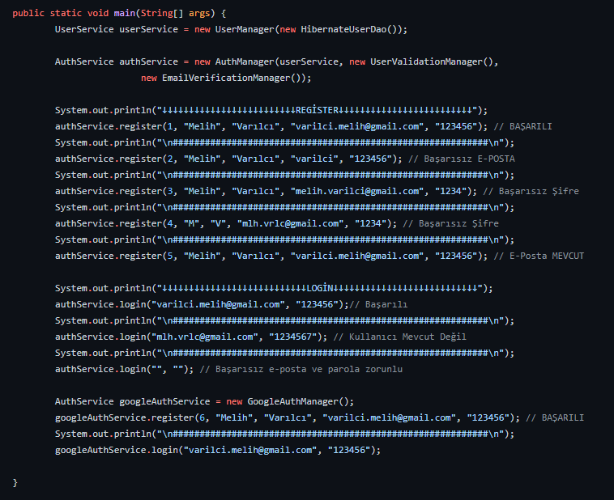
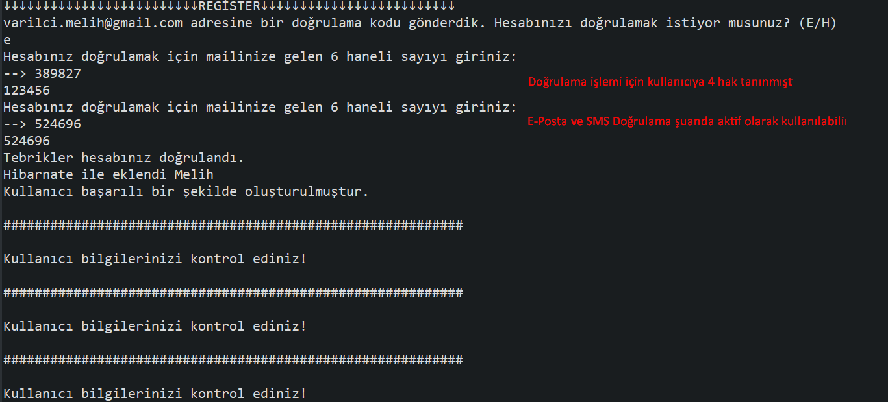
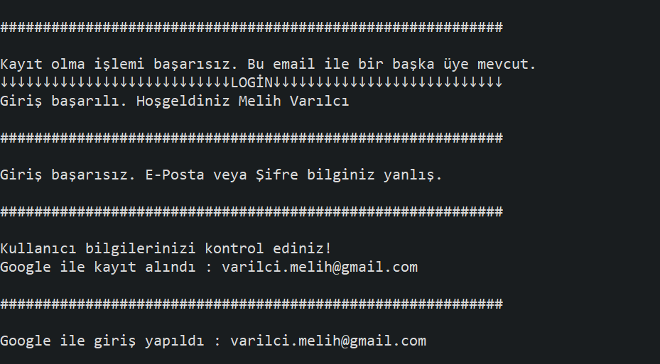

# ECommerce Project - Java Console Çıktıları

- Sisteme temel kullanıcı bilgileri , e-posta ve parolayla üye olunabilmelidir. Temel kullanıcı bilgileri : ad, soyad, e-posta, parola. Temel bilgilerin tamamı zorunludur.
- Parola en az 6 karakterden oluşmalıdır.
- E-posta alanı e-posta formatında olmalıdır. (Regex Kullanılmıştır.)
- E-Posta daha önce kullanılmamış olmalıdır.
- Ad ve soyad en az iki karakterden oluşmalıdır.
- Üyelik sonucu kullanıcıya doğrulama e-postası gönderilmelidir. (Simulasyon edilmiştir)
- Doğrulama için gönderilen kodu 4 defa deneme hakkı vardır yanlış girilmesi sonucunda işlem iptal edilir.
- Hatalı veya başarılı durumda kullanıcı bilgilendirilmelidir.

* * * 
<h2 align="center">
  Main
</h2>

>

* * *
<h2 align="center">
  Console 
</h2>

>

* * *

>

